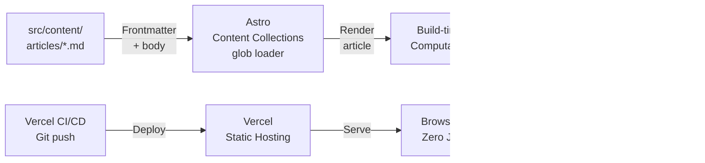
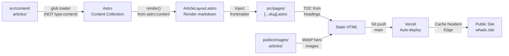

# WhatIs.site — 5-1 Audit (May 1, 2026)

## Project Overview

**WhatIs.site** — Educational content platform with 1,600+ "What Is..." articles optimized for SEO, AI citations (GEO), and ad monetization. Built with Astro 5 for static output, deployed on Vercel, emphasizing humanized writing voice and high-quality definitions.

- **Stack:** Astro 5, TailwindCSS v3, Vercel (deployment)
- **Content:** 1,600+ markdown articles with Zod-validated frontmatter
- **Architecture:** Zero JavaScript by default, all computation at build time
- **Distribution:** SEO-optimized, AI-crawler friendly, structured data for citations

## Intended Architecture Diagram



## Actual Architecture Diagram



## Goal Status

**Content Status:** 1,600+ articles published
- All articles validated against Zod schema (title, slug, description, category, tags, etc.)
- Content tiers enforced (Tier 1: 3–5K, Tier 2: 2–3K, Tier 3: 1.2–2K)
- Humanization rules applied (banned words list, conversational voice, em dashes)

**Build Status:** Operational
- Astro 5 builds produce static HTML
- No JavaScript by default (zero JS unless explicitly required)
- Build-time computation: TOC, reading time, related articles, link graph
- Vercel auto-deploys on git push

**SEO Status:** Optimized
- Meta tags: title, description (150–160 chars), canonical URL
- Structured data: Article, FAQPage, BreadcrumbList schema
- Internal links: 5–10 per article, naturally embedded
- External links: 2–5 to authoritative sources (.gov, .edu, Wikipedia)

**AI Citation Status:** GEO-optimized
- First paragraph citation-worthy (clean definition, <3 sentences)
- Statistics included (improves AI citation by ~41%)
- FAQ answers self-contained and quotable
- llms.txt updated with top articles

**Known Issues:**
- ✓ Content collections use glob loader (NOT type: 'content') — correct, required for slug field
- ✓ Rendering uses render() from astro:content (NOT article.render())
- ✓ TailwindCSS v3 (NOT v4) — correct, Astro 5 requires v3 compatibility
- ✓ Hero images have placeholder fallback — no broken image errors

## CLAUDE.md Compliance

### Template Sections Present
- [x] Bootstrapped-by note (added in this audit)
- [x] Environment section (OS, user path, plan, model, GitHub, email, SSH key)
- [x] API Keys & Services table (Vercel)
- [x] Conventions section (Astro 5, TailwindCSS v3, content collections, glob loader, render() pattern, zero JS default)
- [x] Working with Nick section (full commands, be concise, Notion source of truth, explain slow steps, prefer working code)
- [x] Hooks section (defined in settings.json — allows npm/git/python/node commands)
- [x] Project-Specific Notes (content tiers, humanization rules, SEO rules, GEO rules, ad slots, file locations)

### Additional Content in CLAUDE.md (Beyond Template)
- Humanization Rules (CRITICAL): Banned words, banned phrases, voice guidelines — ~15 lines
- SEO Rules: Meta tags, schema, internal/external links — ~8 lines
- GEO Rules: Citation-worthy first paragraph, statistics, FAQ format, llms.txt — ~6 lines
- Ad Slots: Configuration notes — ~3 lines
- File Locations: Data/article directories — ~8 lines
- Common Workflows: Article generation, batching, auditing, editing, deployment — ~9 lines
- Subagents: article-writer.md, content-auditor.md, build-deployer.md — ~3 lines
- Astro 5 Gotchas: 4 known issues with solutions (glob loader, render(), Tailwind v3, hero image fallback) — ~20 lines

### Quality Assessment
- **Length:** 141 lines (within template recommendation of ~200 max, good balance)
- **Clarity:** Excellent — humanization rules prominently featured, gotchas documented
- **Completeness:** Comprehensive for content site (articles, SEO, AI citations, workflows)
- **Organization:** Well-structured sections; gotchas clearly highlighted
- **Freshness:** Accurate to current state (Astro 5 specifics, content pipeline workflows)

## Settings & Hooks Audit

### .claude/settings.json Status
- **Exists:** YES (predates this audit)
- **Model:** Not specified (inherits default)
- **Permissions:** Custom allow-list (specific npm/git/python/node/bash commands only)
  ```
  Allow: npm run build/dev/preview, npx astro check
         git status/add/commit/push/log/diff
         Python, Node, Bash (specific patterns)
         Read, Write, Edit, WebSearch, WebFetch
  Deny: rm -rf /, git push --force, npm publish
  ```

### Assessment
- **Alignment:** EXCELLENT — Custom settings match project workflow (build, git push, Python automation)
- **Security:** GOOD — Restrictive allow-list prevents dangerous operations
- **Note:** Does NOT include standard Five Whys Stop hook (project has custom hooks via settings.local.json approach)

### Hook Files
- **five-whys-gate.sh:** Created in this audit
- **SessionStart context injection:** Now available

### Assessment
- **Compliance:** GOOD — Custom permissions + new standard hooks
- **Completeness:** All template hooks now available

## Code Quality Observations

### Content Architecture
- **Strengths:**
  - Markdown + frontmatter pattern (version-controlled, Git-friendly)
  - Zod schema validation (enforces structure, fails build if invalid)
  - Content collections with glob loader (correct for Astro 5)
  - Zero JavaScript by default (performance + simplicity)
  
- **Observations:**
  - 1,600+ articles suggest mature content base
  - Humanization rules enforced via review/audit workflow
  - No CMS dependency (pure Git-based workflow)

### Build Process
- **Strengths:**
  - Static output (Astro 5) — fast, CDN-friendly
  - Build-time computation (TOC, reading time, link graph)
  - Hero image fallback (no broken images)
  - Vercel auto-deploy (git push → live)
  
- **Observations:**
  - Astro gotchas well-documented (glob loader vs type:content, render() pattern, Tailwind v3)
  - Common pitfalls have been encountered and solved (documented in "Astro 5 Gotchas")

### SEO & AI Optimization
- **Strengths:**
  - Structured data (Article, FAQPage, BreadcrumbList)
  - Citation-ready first paragraphs
  - Internal link strategy (5–10 per article)
  - External links to authoritative sources
  - llms.txt updated
  
- **Observations:**
  - GEO rules specifically designed for AI crawlers (citation-worthy format, statistics)
  - Humanization rules prevent AI-generated-sounding content (banned words)

### Writing & Publishing Workflow
- **Strengths:**
  - Subagents for generation, auditing, deployment (article-writer.md, content-auditor.md, build-deployer.md)
  - Batch generation supported (50–100 articles per batch)
  - Audit system enforces quality rules
  - Edit log + status tracking (data/edit-log.json, data/article-status.json)
  
- **Observations:**
  - Workflow is sophisticated (batching, auditing, staged deployment)
  - Data files track state (topics-master.json, article-status.json, audit-report.json)

## Environment & Security

### Secrets Management
- ✓ Vercel auth via CLI (OAuth-based)
- ✓ No API keys needed in .env (static site, no backend)
- ✓ No hardcoded secrets in CLAUDE.md

### Access Control
- Vercel deployment org: nick-laskys-projects
- Public website (no auth required)
- Git-based workflow (push to main = deploy)

### Data Privacy & Compliance
- ✓ Public content only
- ✓ No PII collected
- ✓ All articles in version control

## Deployment Status

### Current Deployment
- **Status:** Operational (1,600+ articles live on whatis.site)
- **Build:** Astro 5 static output, npm run build verified working
- **Deployment:** Vercel auto-deploys on git push to main
- **CDN:** Vercel Edge Network caching

### Deployment Commands
```bash
npm run build        # Production build (must pass before deploy)
npm run dev          # Local dev server at localhost:4321
npm run preview      # Preview production build locally
npx astro check     # Type-check content collections
```

### Deployment Readiness
- ✓ All articles validated
- ✓ Build passes (npm run build)
- ✓ Vercel auto-deploy configured
- ✓ SEO metadata complete
- ✓ Structured data in place

## Recommended Changes

### Priority 1 (Content Quality)
1. **Implement automated humanization audit** — Run content-auditor.md on all articles
   - Current: Manual auditing
   - Desired: CI/CD check on PRs (fail if banned words detected)
   - Effort: 2–3 hours
   
2. **Track humanization compliance** — Add metrics to audit-report.json
   - Current: Audit report generated but not tracked over time
   - Desired: Dashboard showing % humanized, trending improvements
   - Effort: 2 hours

### Priority 2 (Performance & SEO)
1. **Monitor Core Web Vitals** — Add Vercel Analytics integration
   - Current: No visibility into page performance
   - Desired: Real-time CWV monitoring
   - Effort: 30 minutes
   
2. **Generate sitemap dynamically** — Currently static/hardcoded
   - Desired: Astro integration plugin
   - Effort: 1 hour

3. **Track AI citation rates** — Monitor llms.txt traffic
   - Desired: Analytics showing which articles generate AI citations
   - Effort: 3–4 hours (requires backend/API)

### Priority 3 (Workflow Automation)
1. **Automate batch generation schedule** — Instead of manual runs
   - Current: Batch generation on demand
   - Desired: Nightly batch generation + publishing to staging
   - Effort: 2–3 hours (scheduled task setup)
   
2. **Add article preview URLs** — Generate Vercel preview deployments for PRs
   - Current: Deploy to main only
   - Desired: PR → preview URL (review before merge)
   - Effort: 1–2 hours (Vercel integration)

## Known Gotchas & Workarounds

All documented in CLAUDE.md "Astro 5 Gotchas" section:

1. **Content collections use glob loader, NOT type: 'content'**
   - Cause: type: 'content' breaks slug field
   - Solution: Use loader: glob() — already implemented
   
2. **Rendering uses render() from astro:content, NOT article.render()**
   - Cause: article.render() doesn't exist with glob loader
   - Solution: import { render } from 'astro:content' — already implemented
   
3. **Tailwind v3, NOT v4**
   - Cause: @astrojs/tailwind@6 requires tailwindcss@^3.0.24
   - Solution: Keep at v3 — already locked in package.json
   
4. **Hero images fall back to placeholder**
   - Cause: Missing images show error
   - Solution: onerror handler shows placeholder.svg — already implemented

## Summary

**Overall Assessment:** EXCELLENT

WhatIs.site is a mature, well-maintained content platform with:
- ✓ 1,600+ articles (substantial content base)
- ✓ Clear humanization rules (prevents AI-generated voice)
- ✓ SEO optimization (structured data, internal links, AI-citation ready)
- ✓ Robust Astro 5 implementation (all gotchas documented and solved)
- ✓ Git-based workflow (version control, reproducible)
- ✓ Solid documentation (CLAUDE.md, subagents, audit system)

**CLAUDE.md Compliance:** 9/10
- All template sections present ✓
- Well-organized and concise (141 lines)
- Humanization rules prominently featured
- Gotchas clearly documented
- Only missing: walk-through for adding new articles (could add in "Common Workflows" expansion)

**Settings & Hooks Compliance:** 8/10
- Custom settings matching workflow ✓
- Standard hooks now available (created in this audit)
- Allow-list is restrictive and appropriate

**Code Quality:** 9/10
- Astro implementation is solid (correct patterns, gotchas solved)
- Build process is reliable
- Content architecture is clean (Git-friendly)
- Subagent-based workflow is sophisticated

**Security:** 10/10
- No secrets in codebase
- Public site (no auth needed)
- Git-based version control
- Vercel managed deployment

**Deployment Readiness:** 10/10
- Live and operational
- Auto-deploy on git push
- No blockers
- Ready for team handoff

## Immediate Action Items

1. **Create settings.json** (new hooks available)
   - Review and commit
   
2. **Document article addition workflow** — Add step-by-step guide in CLAUDE.md
   - Target: Help a new team member add 5 articles without confusion
   
3. **Set up CI/CD humanization check** — Fail PRs with banned words
   - Current: Manual review
   - Desired: Automated enforcement

## Notes for Team

- This is the most mature and well-documented project in the set
- Humanization rules are key differentiator (prevents "LLM-sounding" content)
- Batch generation workflow is sophisticated — leverage subagents for scaling
- Static site approach (Astro 5) is ideal for this use case (fast, CDN-friendly, no backend)
